# Contenido 

* *SciVis and Visual Analytics*.
* Visión y percepción.
* *Preattentive features*.
* El proceso.

# *SciVis and Visual Analytics*.

## *Scientific Visualization*.

::: {layout-ncol=2 layout-valign="bottom"}
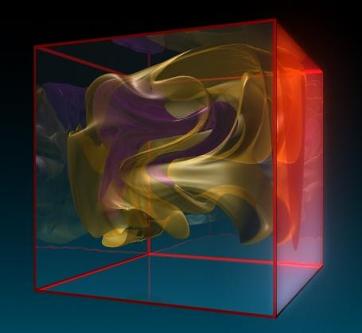{width=3in}

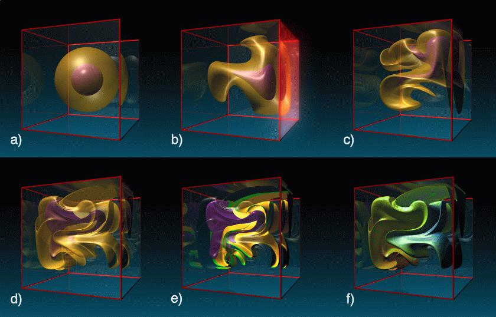{width=4.3in .lightbox}
:::

. . .

::: {layout-ncol=2 layout-valign="top"}

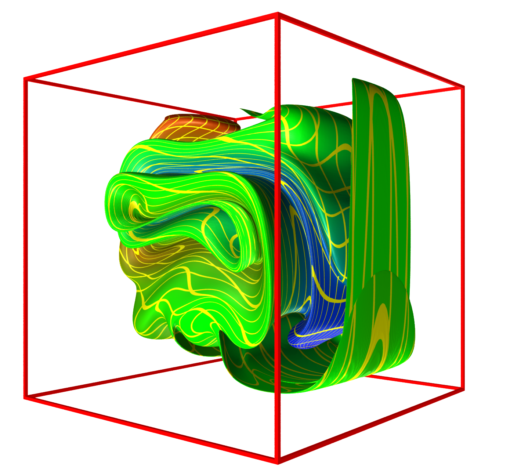{width=2in fig-align="center" .lightbox}

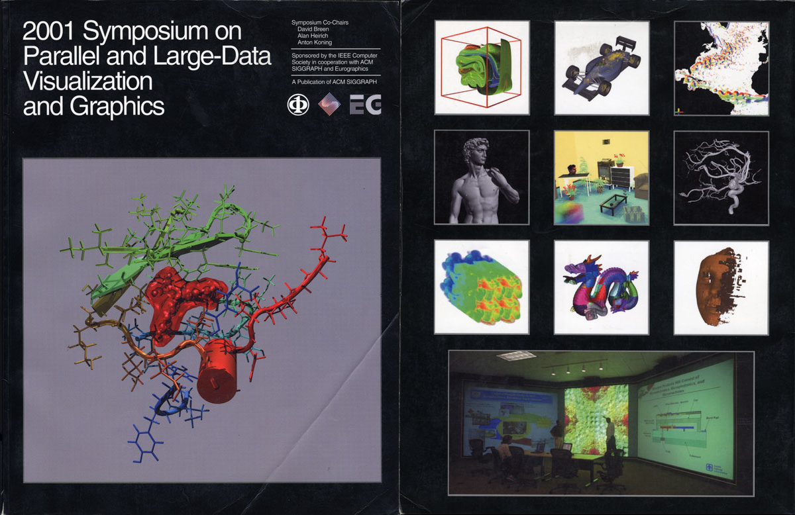{width=3in fig-align="center" .lightbox}
:::

## *Visual Analytics*.

> *Visual analytics* (análisis visual) es un campo multidisciplinario de la ciencia y la tecnología que surgió de la **visualización científica** (*Visualization*) y la **visualización de la información** (*InfoViz*). Se centra en cómo las interfaces visuales interactivas pueden facilitar la exploración de datos complejos, identificar patrones y promover el razonamiento analítico para obtener información útil. 

[IEEE Vis 2026](https://ieeevis.org/year/2026/welcome/): Visualization & Visual Analytics.

## *Visual Analytics*.

* Convertir la información en conocimientos prácticos.
* Comprender las necesidades de información del grupo de usuarios objetivo.
* Determinar qué tipo de datos son los necesarios y qué técnicas de visualización se deben usar.
* Utilizar parámetros visuales: color, contraste, distancia, tamaño, ..., para crear una jerarquía visual adecuada y una ruta visual óptima a través de la información.

## *Visual Analytics and Storytelling*.

::: {.columns}
::: {.column .fragment}
> *There’s always room for a story that can transport people to another place*. J. K. Rowling.

* [The brain science of storytelling](https://youtu.be/m1drR3oaVGc?si=gk49k4vRA_JwC-vU)
    - Cortisol: enfoca la atención.
    - Oxitocina: conexión y empatía.

* [The best stats you've ever seen](https://youtu.be/hVimVzgtD6w?si=4nzvDo-cBV-3thge)

:::
::: {.column .fragment}
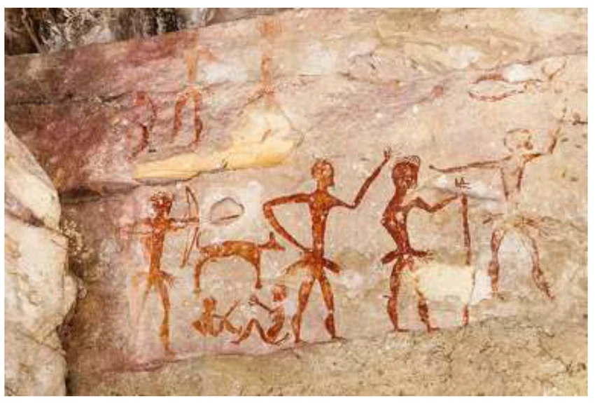{width=5in .lightbox}
:::
:::

# Visión y percepción.

Los conceptos y figuras de esta sección provienen de (Cairo, 2013).

## El ojo humano.

::: {.columns}
::: {.column width="50%"}
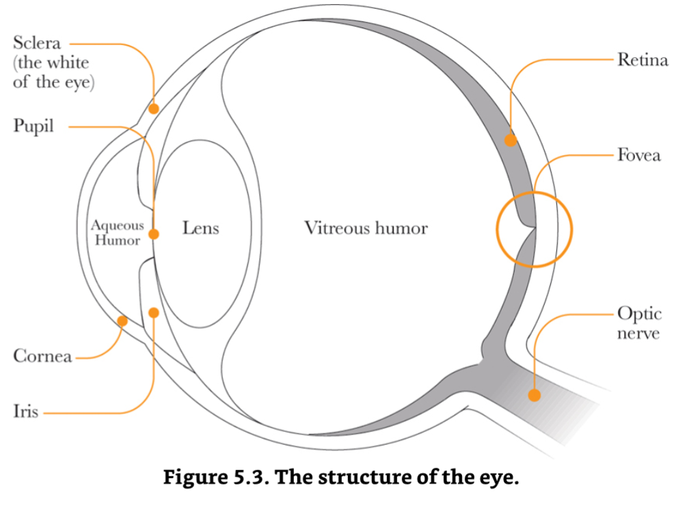{height=4.5in}
:::
::: {.column width="50%"}

* Células fotoreceptoras: 

    

    - Bastones: muy sensibles a la luz débil, no distinguen color. 
    - Conos: Perciben el color.
    

* Fóvea (~0.3mm): 

    

    - Libre de bastones, contiene muchos conos, provee la información más clara y detallada, ahí se enfocan los rayos luminosos.
    

:::
:::

## Visión periférica y mov. sacádicos

::: {layout-ncol=2 layout-valign="top"}

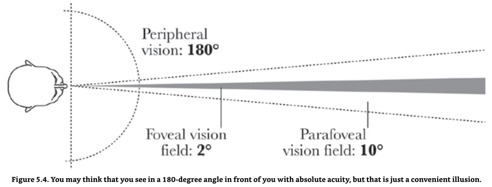{height=2.5in .lightbox}

%20eye%20movements%20and%20vision.pdf)](./figures/movimiento_ojo_experimento.png){height=2.5in .lightbox}

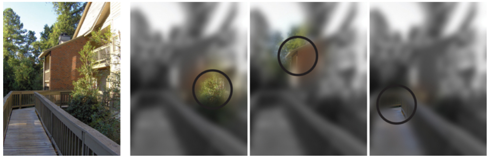{height=2.0in .lightbox}

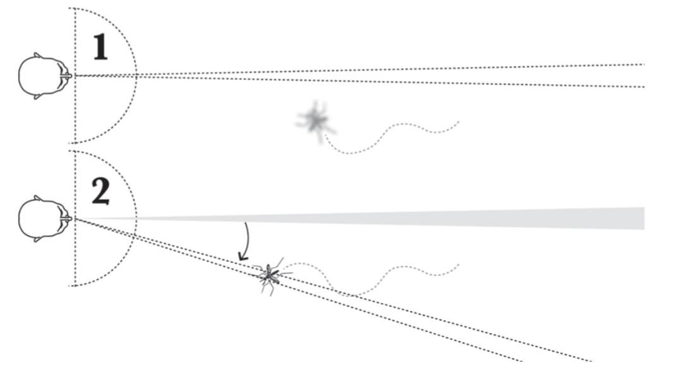{height=2.0in .lightbox}

:::

## El cerebro visual

::: {.columns}
::: {.column width="50%"}
{height=100% .lightbox}

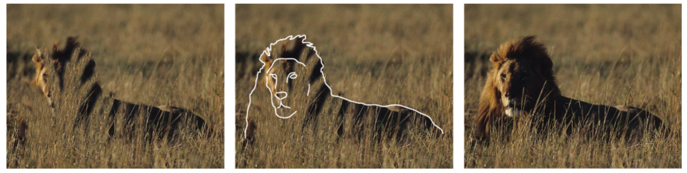{height=100% .lightbox}
:::
::: {.column width="50%"}

* Lo que ve la retina, no es exactamente lo que el cerebro percibe. 
* El cerebro completa información con base en lo que conoce, es eficiente.

:::
:::

::: {.incremental}
* La visión está compuesta de: vista, percepción y cognición.

* Moraleja: si el cerebro le da prioridad a ciertos objetos, entonces prioricemos de antemano.
:::

# *Preattentive features*.

Los conceptos y figuras de esta sección provienen de (Cairo, 2013).

## ¿Qué son?

* *Preattentive features*: propiedades de las imágenes que se procesan en nuestra memoria espacial sin una acción consciente.

* Son procesadas en ~0.5 s por nuestro sistema visual.

> *El mayor valor de una imagen se nota cuando nos obliga a fijarnos en lo que nunca esperábamos ver*, [John Tukey](https://es.wikipedia.org/wiki/John_W._Tukey).

## ¿Cuáles son?

Colin Ware (2013) define cuatro familias de *preattentive features*:

* **Color**. RGB (Red, Green, Blue), sistema aditivo, que usa una estructura hexadecimal #F453A2. [HTML colors](https://htmlcolorcodes.com/).
* **Forma**. Colinealidad, curvatura, longitud, amplitud, ancho, marcadores, cantidad, patrón, tamaño, agrupamiento, orientación, ...
* **Movimiento**. Parpadeo y movimiento espacial.
* **Posicionamiento espacial**. La forma más efectiva es en 2D.

## Ejemplos. {.scrollable}

::: {.columns}
::: {.column width=30%}
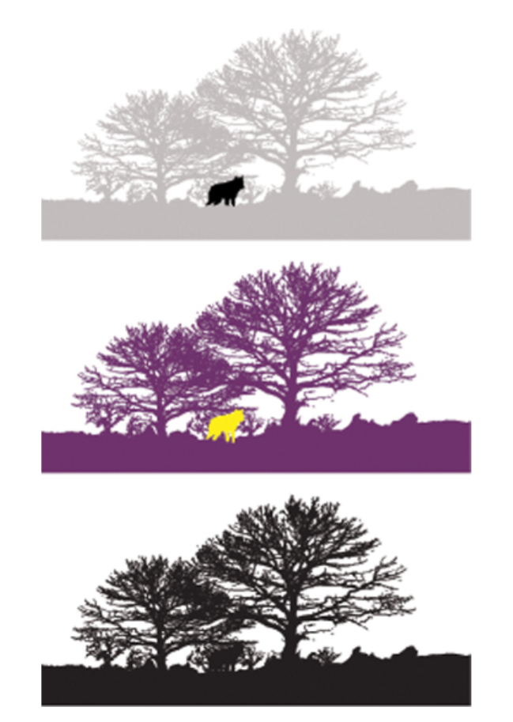{height=4.0in .lightbox}
:::
::: {.column width=30%}
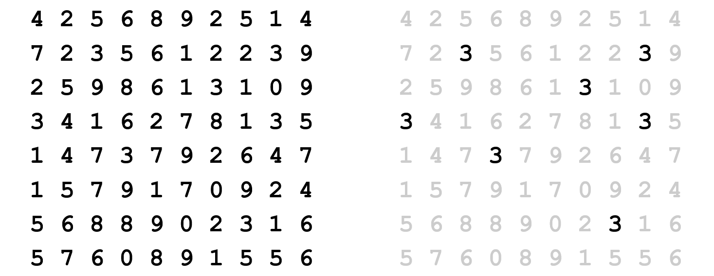{height=1.75in .lightbox}

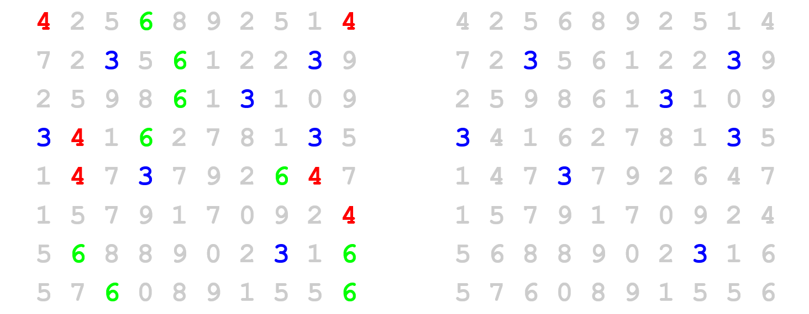{height=1.75in .lightbox}
:::
::: {.column width=30%}
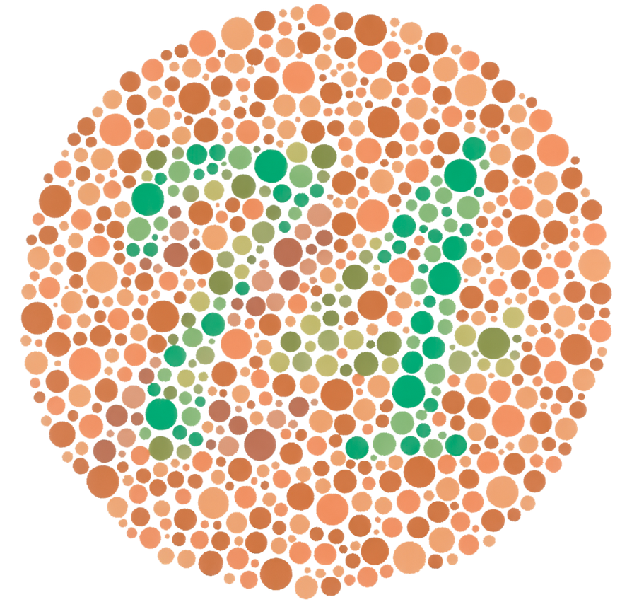{height=2.75in .lightbox}
:::

:::

. . .

* El cerebro detecta más fácilmente las diferencias en contraste y color, que las formas.

# Leyes de la forma (*gestalt*).

::: {.columns}
::: {.column width="40%"}

* El cerebro detecta patrones.

    - Proximidad.
    - Similaridad. 
    - Conectividad. 
    - Continuidad.
    - Agrupamiento. 
    - Cierre.
    - Familiaridad.

:::
::: {.column width="60%"}
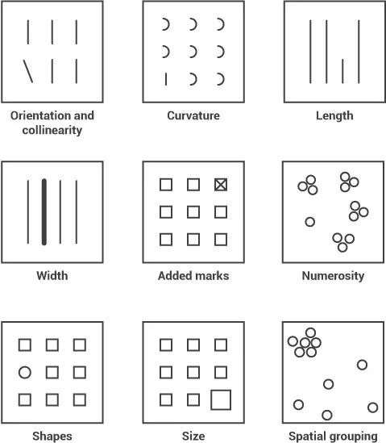{width="20%" .lightbox}
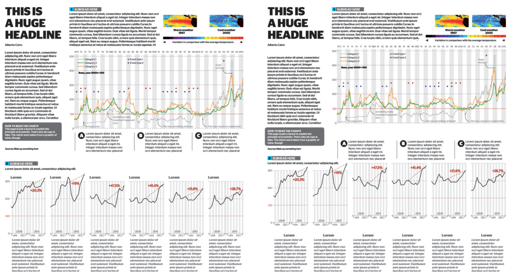{width="40%" .lightbox}
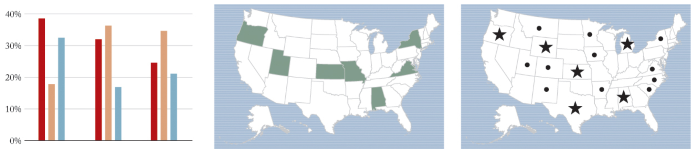{width="60%" .lightbox}
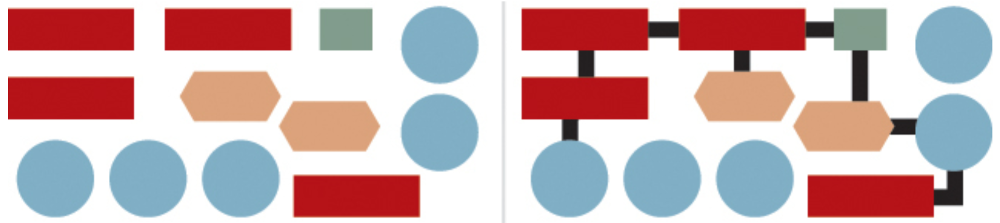{width="60%" .lightbox}
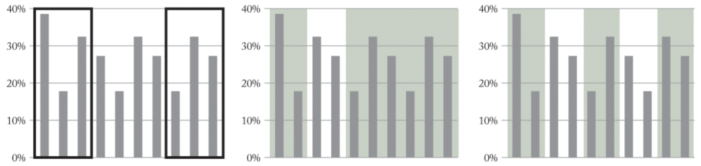{width="60%" .lightbox}

:::
:::

## Clasificación de Cleveland y McGill.

::: {.columns}
::: {.column width="50%"}
La clasificación CM (Clevaland & McGill, 1984) es un método para representar datos y determinar diferencias en la información con precisión o de forma más genérica.

:::
::: {.column width="50%"}
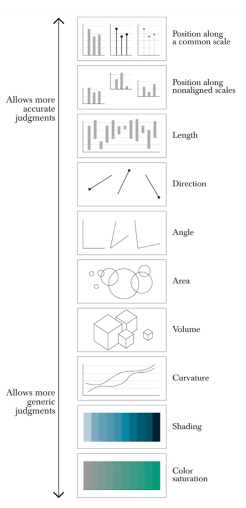{height=6in .lightbox}
:::
:::

# El proceso.

## Storytelling with data.

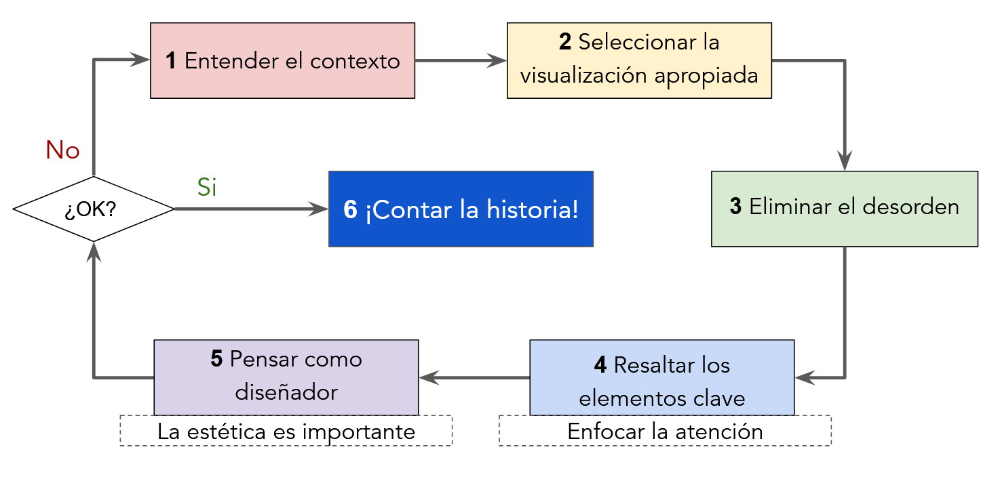

:::{.r-stack}
(Nussbaumer, 2025) y (Nussbaumer, 2019).
:::

##  Referencias.

* Cairo, A. (2013). [The Functional Art: An Introduction to Information Graphics and Visualization](https://www.google.com.mx/books/edition/The_Functional_Art/BiT1ugAACAAJ?hl=en). United Kingdom: New Riders.

* Nussbaumer Knaflic, C. (2025). [Storytelling with Data: A Data Visualization Guide for Business Professionals](https://www.google.com.mx/books/edition/Storytelling_with_Data/zcCFEQAAQBAJ?hl=en&gbpv=0), 10th Anniversary Edition. United Kingdom: John Wiley & Sons, Limited.

* Nussbaumer Knaflic, C. (2019). [Storytelling with Data: Let's Practice! The Workbook](https://www.google.com.mx/books/edition/Storytelling_with_Data/aGatDwAAQBAJ?hl=en&gbpv=0). United Kingdom: Wiley.

* Ware, C. (2013). [Information Visualization: Perception for Design](https://www.google.com.mx/books/edition/Information_Visualization/qFmS95vf6H8C?hl=en&gbpv=0). Germany: Elsevier Science.

* Cleveland, W. S., & McGill, R. (1984). [Graphical perception: Theory, experimentation, and application to the development of graphical methods](https://doi.org/10.2307/2288400). Journal of the American Statistical Association, 79(387), 531.

